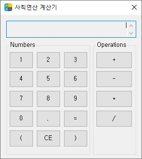
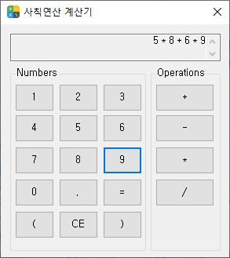
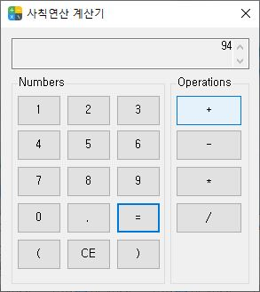
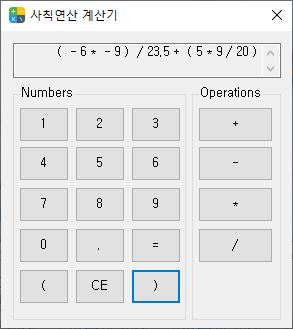
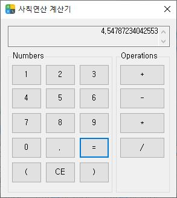
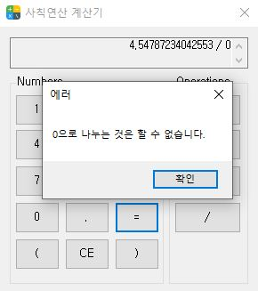

# 3월 8일 문제

## 중위식 표기법 계산기
List, Stack을 이용하여 중위(infix)식 구조에 연산자와 값을 분리하여 삽입하고 
후위(postfix)식 구조로 변환하여 계산하는 윈폼 계산기 입니다.  
- 기본 사칙연산, CE(Clear Entry) 제공 
- 정수, 실수 및 분수 값 형식 제공
- 괄호 우선순위 연산 제공
- 기본적인 예외 처리 제공
- 키보드 입력(버튼 대응) 제공

> 
> 
> 
> 
> 
> 
> 
> 
> 
> 
> 
> 
