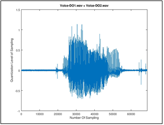

# 재윤이의 열공일기 (h1)
-------------------------
## 1.하루 일과 (h2, checkbox)
- [x] 밥먹기
- [x] 게임하기
- [x] 유튜브시청하기
- [ ] 공부
-----------------------------
### 2.용어 정리 (h3, ol)
1. 패스트포워드
2. 인덱스
3. staged
4. unstaged

[깃 용어 정리_정재윤](재윤_깃용어정리.txt)

----------------------

#### 3.폰트 스타일 + 인라인 코드
__`밤에 라면끓여먹기`__

`4.스터디 요청사항`
- `사랑합니다~!!!!`

##### 5.사진 자랑하기

